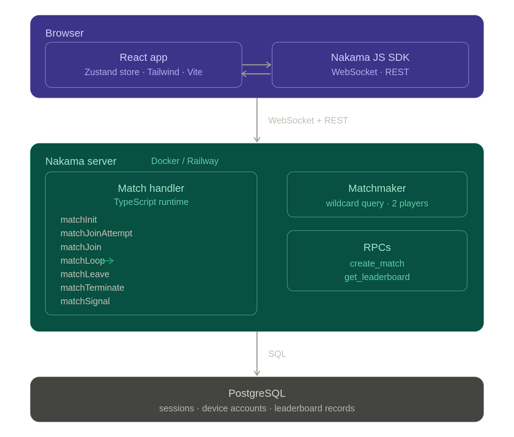
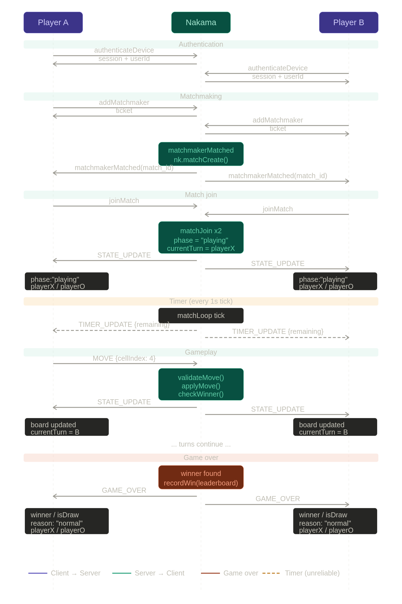

# Tic-Tac-Toe — Real-Time Multiplayer

A real-time multiplayer Tic-Tac-Toe game built with **Nakama** (authoritative game server), **React + Vite** (frontend), and **PostgreSQL** (persistence). Supports Quick Match via matchmaking, private rooms with shareable IDs, per-turn countdown timer, and a global leaderboard.

---

## Table of Contents

1. [Architecture](#architecture)
2. [Design Decisions](#design-decisions)
3. [Setup & Installation](#setup--installation)
4. [Environment Variables](#environment-variables)
5. [Deployment](#deployment)
6. [API & Server Configuration](#api--server-configuration)
7. [Testing Multiplayer](#testing-multiplayer)

---

## Architecture

### High-Level Diagram




### Component Map

```
tic-tac-toe/
├── server/                    # Nakama TypeScript module
│   ├── config/
│   │   ├── constants.ts       # Opcodes, game settings
│   │   └── types.ts           # Server-side interfaces
│   ├── logic/
│   │   └── game.ts            # Pure game logic (no Nakama deps)
│   ├── services/
│   │   ├── broadcast.ts       # broadcastStateUpdate / broadcastGameOver
│   │   └── leaderboard.ts     # recordWin helper
│   ├── match/
│   │   └── handlers.ts        # All match lifecycle callbacks
│   ├── rpcs/
│   │   ├── createMatch.ts     # create_match RPC
│   │   └── getLeaderboard.ts  # get_leaderboard RPC
│   ├── matchmaker.ts          # matchmakerMatched callback
│   └── main.ts                # InitModule — registers everything
│
├── frontend/src/
│   ├── store/
│   │   └── gameStore.ts       # Zustand store + all socket logic
│   ├── components/
│   │   ├── Lobby.tsx          # Main menu
│   │   ├── Matchmaking.tsx    # Waiting screen
│   │   ├── Game.tsx           # Game screen + timer + game-over modal
│   │   ├── Board.tsx          # 3×3 grid + winning-line detection
│   │   └── Leaderboard.tsx    # Top-10 table
│   └── types/game.ts          # Shared wire-format interfaces
│
├── esbuild.config.js          # Custom TS→JS bundler for Nakama/Goja
├── Dockerfile                 # Multi-stage build for Railway
└── docker-compose.yml         # Local dev (Postgres + Nakama + Frontend)
```

---

### Sequence Diagram — Full Game Flow





---

## Design Decisions

### 1. Server-Authoritative Architecture

All game logic runs on the server inside Nakama's TypeScript match handler. The client **only sends moves** and **renders state**. There is no client-side prediction. This makes it impossible to cheat by manipulating board state locally.

```
Client ──► MOVE {cellIndex} ──► Server validates + applies ──► STATE_UPDATE to all
```

### 2. Server-Tick Timer System

The timer is driven by Nakama's `matchLoop`, which runs at a configurable **tick rate** (1 tick/second). This is the key design: instead of a real-time clock, elapsed time is measured by counting ticks.

```typescript
// handlers.ts — matchLoop
const elapsed = tick - state.turnStartedAt; // ticks since turn began
const remaining = state.turnTimeLimit - elapsed; // ticks remaining (= seconds)

dispatcher.broadcastMessage(OPCODES.TIMER_UPDATE, JSON.stringify({ remaining }), null, null, false);
```

**Why ticks?**

- The server is the single source of truth for time — no clock skew between players
- `turnStartedAt` is set to the current tick when a turn begins (in `matchJoin` on game start, and after each valid move in `matchLoop`)
- Timeout detection is a simple integer comparison: `if (remaining <= 0)`
- `TIMER_UPDATE` is broadcast as **unreliable** (last arg `false`) — the client tolerates dropped frames since the server enforces the actual timeout

```
turnTimeLimit = 30   (30 ticks = 30 seconds at tickRate:1)
turnStartedAt = N    (tick when turn began)
elapsed       = currentTick - N
remaining     = 30 - elapsed
```

### 3. Clean Module Separation

The server code is split so that **pure game logic has zero Nakama dependencies**:

| Layer    | File                             | Responsibility                                                                    |
| -------- | -------------------------------- | --------------------------------------------------------------------------------- |
| Config   | `constants.ts`, `types.ts`       | Opcodes, interfaces, settings                                                     |
| Logic    | `game.ts`                        | `createInitialState`, `validateMove`, `applyMove`, `checkWinner` — no `nk` object |
| Services | `broadcast.ts`, `leaderboard.ts` | Nakama I/O helpers                                                                |
| Handlers | `match/handlers.ts`              | Wires logic + services into Nakama lifecycle                                      |
| RPCs     | `rpcs/`                          | HTTP endpoints callable from client                                               |

This means game logic can be unit-tested independently of Nakama.

### 4. Reliable vs Unreliable Messages

Not all messages need guaranteed delivery:

| Opcode             | Direction       | Reliable        | Reason                                |
| ------------------ | --------------- | --------------- | ------------------------------------- |
| `MOVE` (1)         | Client → Server | Yes (WebSocket) | Must not be dropped                   |
| `STATE_UPDATE` (2) | Server → Client | **Yes**         | Board state must be consistent        |
| `GAME_OVER` (3)    | Server → Client | **Yes**         | Final result must arrive              |
| `ERROR` (4)        | Server → Client | **Yes**         | Player must see validation errors     |
| `TIMER_UPDATE` (5) | Server → Client | **No**          | Visual only — server enforces timeout |

### 5. Race Condition Fix on Match Join

When the matchmaker fires, the client sets fresh game state **before** awaiting `joinMatch`. This prevents a `STATE_UPDATE` arriving during the async join from being overwritten by a late `freshGame()` reset:

```typescript
// Set screen + reset state FIRST
set({ ...freshGame(), screen: "game", matchmakerTicket: null });

// THEN join — any STATE_UPDATE during this await goes into fresh state
const match = await socket.joinMatch(joinId);
set({ matchId: match.match_id });
```

### 6. Failure Handling

| Failure              | Detection                               | Response                                                                          |
| -------------------- | --------------------------------------- | --------------------------------------------------------------------------------- |
| Opponent disconnects | `matchLeave` during playing             | Survivor wins automatically via `broadcastGameOver(..., "opponent_disconnected")` |
| Turn timeout         | `remaining <= 0` in `matchLoop`         | Timed-out player loses, `broadcastGameOver(..., "timeout")`                       |
| Invalid move         | `validateMove` returns `{valid: false}` | `ERROR` opcode sent only to that player; game continues                           |
| Server shutdown      | `matchTerminate`                        | `broadcastGameOver(..., "server_shutdown")`                                       |
| WebSocket disconnect | `socket.ondisconnect` on client         | Error toast, redirect to lobby                                                    |
| Match join failure   | `try/catch` around `joinMatch`          | Error toast, redirect to lobby                                                    |

### 7. Custom TypeScript Bundler

Nakama runs TypeScript through **Goja** (a JavaScript engine). Goja's AST inspector panics on ES2015+ object shorthand (`{ state }` instead of `{ state: state }`). The project uses TypeScript's own `transpileModule` API (not esbuild) which preserves longhand notation:

```javascript
// esbuild.config.js — concatenates all .ts files, then transpiles as one blob
const result = ts.transpileModule(combined, {
  compilerOptions: { target: ts.ScriptTarget.ES2015, module: ts.ModuleKind.CommonJS },
});
```

### 8. Device-Based Authentication

No login screen. On first load, a UUID is generated and stored in `localStorage`. Nakama's `authenticateDevice` creates an account tied to that UUID. Username is auto-generated as `Player_XXXXXX`. This removes friction while still giving each player a persistent identity and leaderboard entry.

---

## Setup & Installation

### Prerequisites

- [Docker](https://docs.docker.com/get-docker/) and Docker Compose
- [Node.js 20+](https://nodejs.org/) (for local server builds)

### 1. Clone & configure environment

```bash
git clone https://github.com/Aakash-0003/Tic-Tac-Toe.git
cd tic-tac-toe

# Copy the example env file and edit if needed
cp .env.example .env          # root-level (used by docker-compose)
cp frontend/.env.example frontend/.env
```

Default `.env` values work out of the box for local development.

### 2. Build the Nakama server module

```bash
npm install
npm run build          # compiles server/  →  build/index.js
```

### 3. Start everything with Docker Compose

```bash
docker-compose up
```

This starts three services:

| Service             | URL                   |
| ------------------- | --------------------- |
| Frontend (Vite dev) | http://localhost:3000 |
| Nakama HTTP API     | http://localhost:7350 |
| Nakama Console      | http://localhost:7351 |
| PostgreSQL          | localhost:5432        |

### 4. Rebuild server after changes

```bash
npm run dev            # rebuilds build/index.js and restarts nakama container
```

---

## Environment Variables

### Root `.env` (docker-compose interpolation)

| Variable            | Default      | Description                               |
| ------------------- | ------------ | ----------------------------------------- |
| `NAKAMA_SERVER_KEY` | `defaultkey` | Client authentication key                 |
| `NAKAMA_HOST`       | `0.0.0.0`    | Nakama bind address                       |
| `NAKAMA_PORT`       | `7350`       | Nakama HTTP/WS port                       |
| `DB_USER`           | `postgres`   | PostgreSQL username                       |
| `DB_PASSWORD`       | `localdb`    | PostgreSQL password                       |
| `DB_NAME`           | `nakama`     | PostgreSQL database name                  |
| `VITE_NAKAMA_KEY`   | `defaultkey` | Must match `NAKAMA_SERVER_KEY`            |
| `VITE_NAKAMA_HOST`  | `localhost`  | Nakama host (browser perspective)         |
| `VITE_NAKAMA_PORT`  | `7350`       | Nakama port (browser perspective)         |
| `VITE_NAKAMA_SSL`   | `false`      | `true` in production (Railway uses HTTPS) |

### `frontend/.env` (Vite — injected at build time)

```env
VITE_NAKAMA_KEY=defaultkey
VITE_NAKAMA_HOST=localhost
VITE_NAKAMA_PORT=7350
VITE_NAKAMA_SSL=false
```

> **Never commit `.env` files.** Only `.env.example` files are committed. The `.gitignore` excludes all `.env` files.

---

## Deployment

### Architecture

```
Vercel (free CDN)          Railway (hobby plan)
─────────────────          ───────────────────
React frontend        →    Nakama (Docker)
                      →    PostgreSQL (addon)
```

### Step 1 — Push to GitHub

```bash
git add .
git commit -m "initial commit"
git remote add origin https://github.com/YOUR_USER/tic-tac-toe.git
git push -u origin main
```

### Step 2 — Deploy Nakama on Railway

1. [railway.app](https://railway.app) → **New Project** → **Deploy from GitHub repo**
2. Railway detects the `Dockerfile` at the repo root automatically
3. **Add database:** In project → **+ New** → **Database** → **PostgreSQL**
4. **Set environment variables** on the Nakama service:
   ```
   DATABASE_URL=${{Postgres.DATABASE_URL}}
   NAKAMA_SERVER_KEY=your_strong_secret_key
   PORT=7350
   ```
   > `${{Postgres.DATABASE_URL}}` is a Railway variable reference — it copies the value from the Postgres service into the Nakama service at deploy time.
5. **Set port:** Service Settings → Networking → Expose port `7350` → Generate Domain
6. Note your public URL: `https://nakama-production-xxxx.up.railway.app`

The `Dockerfile` `ENTRYPOINT` handles migrations and startup automatically on each deploy:

```sh
DB=$(echo "$DATABASE_URL" | sed 's|^postgres[a-z]*://||')
/nakama/nakama migrate up --database.address "$DB"
exec /nakama/nakama --database.address "$DB" --socket.server_key "${NAKAMA_SERVER_KEY}" \
  --socket.address "0.0.0.0" --socket.port "${PORT:-7350}" --runtime.js_entrypoint "index.js"
```

### Step 3 — Deploy Frontend on Vercel

1. [vercel.com](https://vercel.com) → **Add New Project** → import GitHub repo
2. Set **Root Directory** → `frontend`
3. Vercel auto-detects Vite (build: `npm run build`, output: `dist`)
4. **Set environment variables:**
   ```
   VITE_NAKAMA_KEY=your_strong_secret_key
   VITE_NAKAMA_HOST=nakama-production-xxxx.up.railway.app
   VITE_NAKAMA_PORT=443
   VITE_NAKAMA_SSL=true
   ```
5. Deploy → Vercel gives you a `https://your-app.vercel.app` URL

> Port `443` is used because Railway terminates TLS externally and forwards to your container on `7350`. The `VITE_NAKAMA_SSL=true` flag switches the Nakama client and WebSocket to use HTTPS/WSS.

---

## API & Server Configuration

### WebSocket Opcodes

All real-time game messages use Nakama's match data system with numeric opcodes:

| Opcode | Name           | Direction       | Payload                                               |
| ------ | -------------- | --------------- | ----------------------------------------------------- |
| `1`    | `MOVE`         | Client → Server | `{ cellIndex: 0–8 }`                                  |
| `2`    | `STATE_UPDATE` | Server → Client | `{ board, currentTurn, phase, playerX, playerO }`     |
| `3`    | `GAME_OVER`    | Server → Client | `{ board, winner, isDraw, reason, playerX, playerO }` |
| `4`    | `ERROR`        | Server → Client | `{ reason: string }`                                  |
| `5`    | `TIMER_UPDATE` | Server → Client | `{ remaining: number }`                               |

### STATE_UPDATE Payload

```json
{
  "board": [0, 1, 0, 0, 2, 0, 0, 0, 0],
  "currentTurn": "user-uuid-of-active-player",
  "phase": "waiting | playing | game_over",
  "playerX": "user-uuid",
  "playerO": "user-uuid"
}
```

Board values: `0` = empty, `1` = X, `2` = O

### GAME_OVER Reasons

| Reason                    | Meaning                                                       |
| ------------------------- | ------------------------------------------------------------- |
| `"normal"`                | A player completed a winning line, or all cells filled (draw) |
| `"timeout"`               | Active player's 30-second turn timer expired                  |
| `"opponent_disconnected"` | Opponent's WebSocket closed during an active game             |
| `"server_shutdown"`       | Nakama server is shutting down (`matchTerminate`)             |

### RPCs (HTTP endpoints)

| RPC Name          | Method                         | Description                                            |
| ----------------- | ------------------------------ | ------------------------------------------------------ |
| `create_match`    | POST `/v2/rpc/create_match`    | Creates an authoritative match, returns `{ match_id }` |
| `get_leaderboard` | POST `/v2/rpc/get_leaderboard` | Returns top-10 win records                             |

All RPCs require a valid Nakama session token in the `Authorization: Bearer <token>` header.

### Match Settings

```typescript
// server/config/constants.ts
TURN_TIME_LIMIT = 30; // seconds per turn (= ticks at tickRate:1)
LEADERBOARD_ID = "global_wins";
MATCH_HANDLER = "tic_tac_toe";

// server/match/handlers.ts
tickRate = 1; // 1 matchLoop call per second
```

### Nakama Console

Access the admin console at `http://localhost:7351` (local) to inspect:

- Active matches and their state
- Player accounts and sessions
- Leaderboard records
- Server logs

---

## Testing Multiplayer

### Local (two browser tabs)

1. Start the stack: `docker-compose up`
2. Open **two** separate browser tabs at `http://localhost:3000`
3. In both tabs, click **⚡ QUICK MATCH**
4. Nakama's matchmaker pairs them (2-player wildcard query) — both screens transition to the game board
5. Click cells in the active tab — the move appears in the other tab in real-time
6. Let the 30-second timer run out to test the timeout path

### Private Room

1. In Tab A: click **＋ CREATE ROOM** — a match ID appears
2. Copy the match ID
3. In Tab B: click **→ JOIN ROOM**, paste the ID, press **JOIN**
4. Both players land in the same game

### Verify the Nakama server is healthy

```bash
curl http://localhost:7350/healthcheck
# → {}  (HTTP 200)
```

### Test failure scenarios

| Scenario            | How to trigger                      | Expected result                                               |
| ------------------- | ----------------------------------- | ------------------------------------------------------------- |
| Opponent disconnect | Close one browser tab mid-game      | Remaining player sees "Opponent disconnected" win modal       |
| Turn timeout        | Start a game, don't click anything  | After 30 s, the inactive player loses; game-over modal shows  |
| Invalid move        | (requires direct WebSocket message) | Server sends ERROR opcode; client shows toast; game continues |
| Server restart      | `docker-compose restart nakama`     | Both clients get disconnect toast and return to lobby         |

### Production smoke test

After deploying to Railway + Vercel:

```bash
# 1. Confirm Nakama is up
curl https://nakama-production-xxxx.up.railway.app/healthcheck

# 2. Open two browser tabs at your Vercel URL
# 3. Quick Match → play a game → check the leaderboard
```

---

## Tech Stack Summary

| Layer        | Technology                               | Why                                                                         |
| ------------ | ---------------------------------------- | --------------------------------------------------------------------------- |
| Game server  | [Nakama](https://heroiclabs.com/nakama/) | Authoritative match loop, matchmaker, leaderboard, WebSocket out of the box |
| Server logic | TypeScript → Goja (JS)                   | Type-safe server code compiled to Nakama's JS runtime                       |
| Database     | PostgreSQL                               | Nakama's required persistence layer; stores accounts and leaderboard        |
| Frontend     | React 18 + Vite                          | Fast dev cycle, component-based UI                                          |
| State        | Zustand                                  | Minimal boilerplate; single store mirrors server state                      |
| Animations   | Framer Motion                            | Spring physics for board cells, timer pulse, screen transitions             |
| Styling      | Tailwind CSS                             | Utility-first, dark-themed design                                           |
| Local dev    | Docker Compose                           | Single command to run Postgres + Nakama + frontend                          |
| Production   | Railway + Vercel                         | Railway for stateful backend; Vercel CDN for static frontend                |
